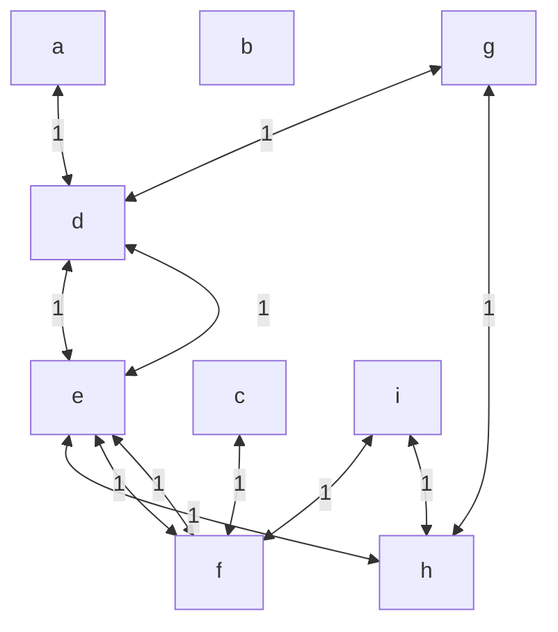

# Busca Heurística - Robô para limpeza de uma sala

#### O que deve ser feito?

- Mapeie a sala como um tabuleiro. Nesse sentido, a sala deve ser representada como uma matriz, análoga a um tabuleiro (toda a sala é previamente mapeada).
- A sala possui obstáculos e as sujeiras estão armazenados em posições na sala. Assim, cada posição da sala pode possuir estruturas para armazenar sujeira ou obstáculo em uma posição da sala, caso existam. 
- Considere que o robô muda de estado ao se mover para uma posição à esquerda, à direita ou outras posições que vocês achem que é possível (diagonal, para frente ou para trás).
- Construa relações necessárias para representar a mudança de estado do robô, quando ele troca de posição na sala. 
- Construa uma heurística de custo e uma de avaliação para encontrar o caminho do robô. 
- O caminho a ser percorrido pelo robô é percorrer todos os estados com sujeira para limpar toda a sala, de tal maneira que percorra o menor percurso possível. 
- Estabeleça uma posição inicial e uma posição final no mapa da sala para serem os estados iniciais e finais. 
- Ao visitar um estado (posição) com sujeira, marque-o como limpo. Para isso, podem ser utilizados predicados que gerenciam a base de fatos em Prolog, dentre eles assert/1, que insere um fato na base de fatos, e retract/1, que remove um fato na base de fatos

---

#### Como funciona o programa?

- A sala é representada por uma matriz, como por exemplo a matriz:

| 0 | 1 | 2 |
|---|---|---|
| a | b | c |
| d | e | f |
| g | h | i |

- Desta forma, a sujeira será representada no código por:
  - sujeira(c).
  - sujeira(h).

- Também, o bloqueado será:
  - bloqueado(b).

 - Então, o grafo que representará será:

